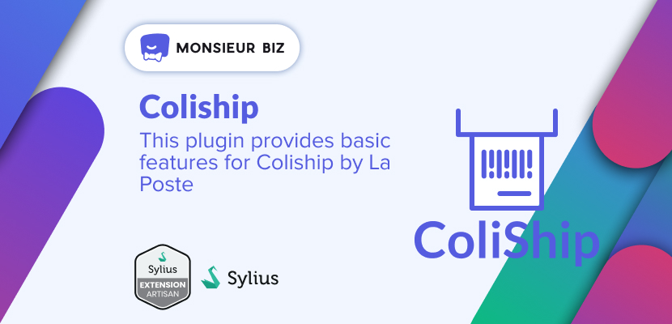

[](https://monsieurbiz.com/agence-web-experte-sylius)

<h1 align="center">Coliship for Sylius</h1>

[](https://github.com/monsieurbiz/SyliusColishipPlugin/actions?query=workflow%3ATests)
[](https://github.com/monsieurbiz/SyliusColishipPlugin/actions?query=workflow%3ASecurity)
[](https://github.com/monsieurbiz/SyliusColishipPlugin/actions?query=workflow%3ASecurity)

This plugin gives you an enhanced address with all Coliship fields (that's all for now).

## Compatibility

| Sylius Version | PHP Version     |
|----------------|-----------------|
| 1.12           | 8.2 - 8.3       |
| 1.13           | 8.2 - 8.3       |
| 1.14           | 8.2 - 8.3       |

## Installation

If you want to use our recipes, you can configure your composer.json by running:

```bash
composer config --no-plugins --json extra.symfony.endpoint '["https://api.github.com/repos/monsieurbiz/symfony-recipes/contents/index.json?ref=flex/master","flex://defaults"]'
```

```bash
composer require monsieurbiz/sylius-coliship-plugin
```

Change your `config/bundles.php` file to add the line for the plugin : 

```php
<?php

return [
    //..
    MonsieurBiz\SyliusColishipPlugin\MonsieurBizSyliusColishipPlugin::class => ['all' => true],
];
```

Then create the config file in `config/packages/monsieurbiz_coliship_plugin.yaml` :

```yaml
imports:
    - { resource: "@MonsieurBizSyliusColishipPlugin/Resources/config/monsieurbiz/settings.yaml" }
    - { resource: "@MonsieurBizSyliusColishipPlugin/Resources/config/sylius/grid.yaml" }
    - { resource: "@MonsieurBizSyliusColishipPlugin/Resources/config/sylius/ui.yaml" }
```

Then import the routes in `config/routes/monsieurbiz_coliship_plugin.yaml` : 

```yaml
monsieurbiz_coliship_admin:
    resource: "@MonsieurBizSyliusColishipPlugin/Resources/config/routes/admin.yaml"
    prefix: /%sylius_admin.path_name%
```

Update `App\Entity\Shipping\ShippingMethod` to implements `ColishipShippingMethodInterface` and use `ColishipShippingMethodTrait`.

Update `App\Entity\Addressing\Address` to implements `ColishipAddressInterface` and use `ColishipAddressTrait`.

Finally, update your database schema :

```bash
bin/console doctrine:migrations:diff
bin/console doctrine:migrations:migrate
```

## Contributing

You can find a way to run the plugin without effort in the file [DEVELOPMENT.md](./DEVELOPMENT.md).

Then you can open an issue or a Pull Request if you want! 😘  
Thank you!

## License

This plugin is completely free and released under the [MIT License](https://github.com/monsieurbiz/SyliusColishipPlugin/blob/master/LICENSE).
